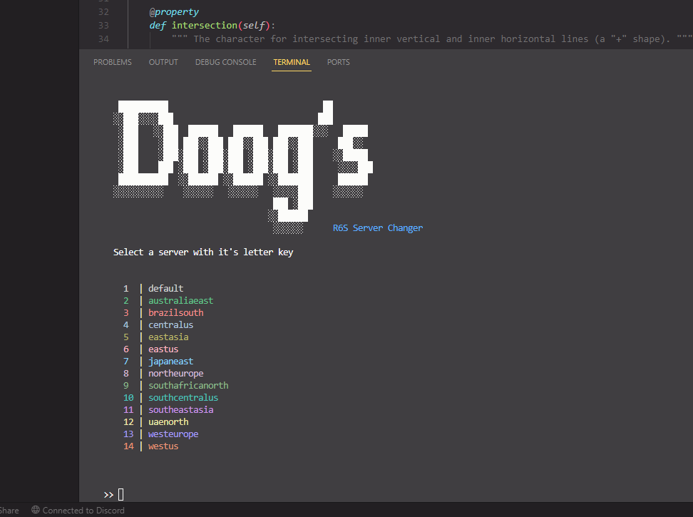

# r6server
 A server changer tool for Rainbow Six Siege
 <br>
 Just a silly little tool I made to change the r6s server for my friends and I. It speeds up my process. 



# How to use
Start the .exe and choose the server you want to use.
<br>
The app also automatically attempts to start siege (assuming your siege is stored in the C drive in the default steam folder).

# Running as python
Run `pip install -r requirements.txt` to install all prequisites. Then run `py r6server.py`

# Building
I used Python 3.10.10. You'll need to get PyInstaller for this. You can change the name and favicon to anything you like.
<br>
<br>
PyInstaller Command:
```
pyinstaller r6server.py -F -n "R6 Server Changer" -i "favicon.ico"
```
<br>
You should see it in `/dist`` after it's completed.